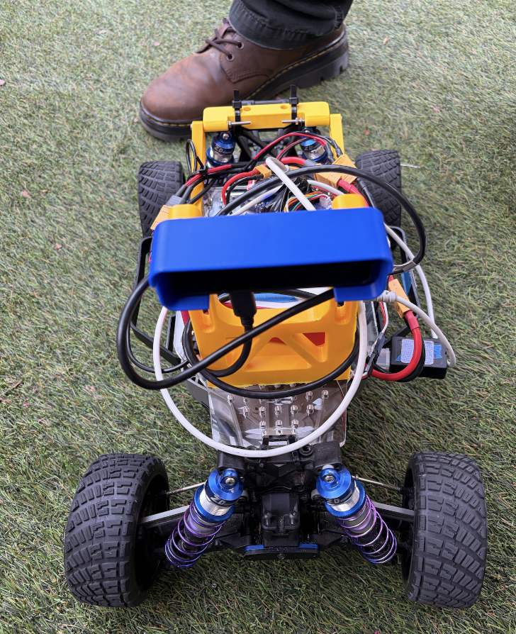
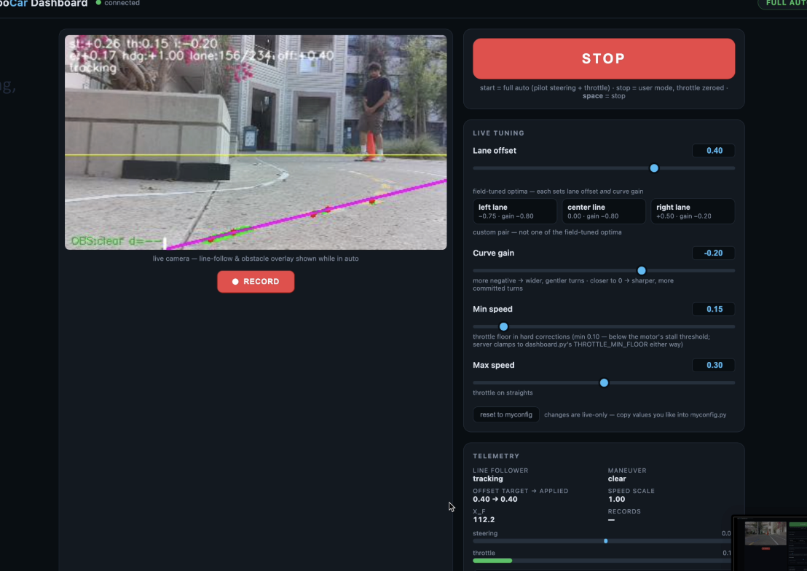

# UCSD-DSC190-SUMMER_I-Final_Project-Team_1

# Autonomous Lane Following & Obstacle Avoidance with Agentic Development

**Team 1 — DSC 190 (Summer I), Track 2: Agentic Development**

**Team members:** Silas Jude, Madhav Krishnaraj, Rami Abukhater, Toby Zhang

<p align="center">
  
</p>

## Overview

This project builds an autonomous 1/10-scale RC car on the [Donkeycar](https://github.com/autorope/donkeycar) platform that follows a marked track and avoids obstacles using classical computer vision (no deep-learning model). The car runs on a Raspberry Pi with an OAK-D depth camera and drives an outdoor pedestrian plaza marked with a dashed yellow centreline and solid white boundary lines.

The car performs three tasks:

- **Mission 1 — Centreline following:** follow the dashed yellow centreline.
- **Mission 2 — Lane following:** stay within one lane, bounded by the yellow line on one side and the outer white line on the other, without crossing either.
- **Obstacle avoidance:** detect traffic cones and either swerve within the lane or change lane entirely.

The hard parts are that the centreline is *dashed* (the primary signal disappears several times a second), the track is *outdoors* (lighting swings from full sun to deep shadow within one lap), and the plaza is a real environment full of planters, benches, glass doors and pedestrians that must not be mistaken for lane markings.

## Demo & presentation

**Demo video** — click the preview below to watch the car line-following and avoiding obstacles on autopilot:

[](https://drive.google.com/file/d/1HX0A4RsHaGcY5_dvtlrdN2-dFmzvkscr/view?usp=sharing)

- **Demo video (direct link):** https://drive.google.com/file/d/1HX0A4RsHaGcY5_dvtlrdN2-dFmzvkscr/view?usp=sharing
- **Final presentation (Google Slides):** https://docs.google.com/presentation/d/10fKYDSIw8ZOM-bpjuJorGRp1Ba1uUbfYah_yTGAOlgI/edit?usp=sharing

## How the detector works

Two design decisions make the approach robust:

- **Colour detection in CIELAB on local contrast, not absolute values.** The stock Donkeycar follower thresholds HSV, which fails outdoors because the tape's saturation and colour shift with lighting. Instead the mask keys on the tape being consistently *yellower than the pavement immediately around it* in every lighting condition, with an absolute test retained for night driving.
- **Multi-band centroid fitting, not a single scanline.** The detector scans a tall region split into horizontal bands, finds a centroid per band, and fits a line through them — yielding both lateral offset and heading, and surviving the gaps in the dashed line.

When yellow is lost, the controller degrades through a fallback ladder: yellow dash -> two-white-line lane centre -> single-side white line -> near-white tracker -> coast -> stop.

## Source code

All of the code we wrote lives in [`linefollower_car/`](./linefollower_car). It is a snapshot of what runs on the Pi at `~/mycar`. See [`linefollower_car/README.md`](./linefollower_car/README.md) for full details.

### Programs we wrote

| file | what it is |
|---|---|
| `linefollower_car/manage_line.py` | vehicle assembly script — the Donkeycar template this car drives with |
| `linefollower_car/line_following.py` | the CV controller — yellow dashed-line follower with white-boundary fallback |
| `linefollower_car/obstacle_detector.py` | cone / obstacle detection |
| `linefollower_car/obstacle_avoidance.py` | swerve / lane-change planning around detected obstacles |
| `linefollower_car/lf_telemetry.py` | per-frame JSONL telemetry, joined to the recorded image tub by frame index |
| `linefollower_car/dashboard.py` | web dashboard: live tuning, lane presets, low-latency video |
| `linefollower_car/dashboard.html` | the dashboard page (no build step, loads over the car's own WiFi) |
| `linefollower_car/calibrate.py` | steering / throttle calibration helper |
| `linefollower_car/myconfig.py` | this car's config overrides |
| `linefollower_car/lf_tools/` | offline replay and simulation tools |

### Engineering notes

| file | what it covers |
|---|---|
| `linefollower_car/HANDOFF.md` | running notes — tuning history and what was tried |
| `linefollower_car/KNOWN_ISSUES.md` | confirmed bugs that are not fixed, with session/frame indices |
| `linefollower_car/WORKLOG_20260730.md` | corner-failure analysis and dashboard changes |

## How to use it

The code targets a Donkeycar-based RC car (Raspberry Pi + OAK-D camera). To run it, copy the contents of `linefollower_car/` into the car directory on the Pi and drive:

```bash
cd ~/mycar
python manage_line.py drive
```

The live-tuning dashboard is then served at `http://<car>:8887/dashboard`, with the stock Donkeycar UI still available at `/drive`.

The recorded data tub, logs, models and backups are deliberately excluded from this snapshot — they are data, not source. The analysis in `WORKLOG_20260730.md` cites them by session and frame index.

## Upstream contribution

One general-purpose fix from this work — the Donkeycar MJPEG dashboard stream was sending every camera frame ~8 times over — was separated out as a single-purpose contribution to the upstream library (with unit tests), while the track-specific car code is kept in our fork.

## Full source repository

The complete Donkeycar fork, including full commit history, lives at: https://github.com/silasjude/donkeycar
